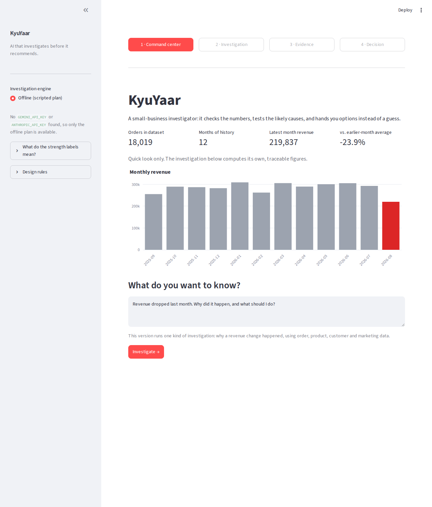
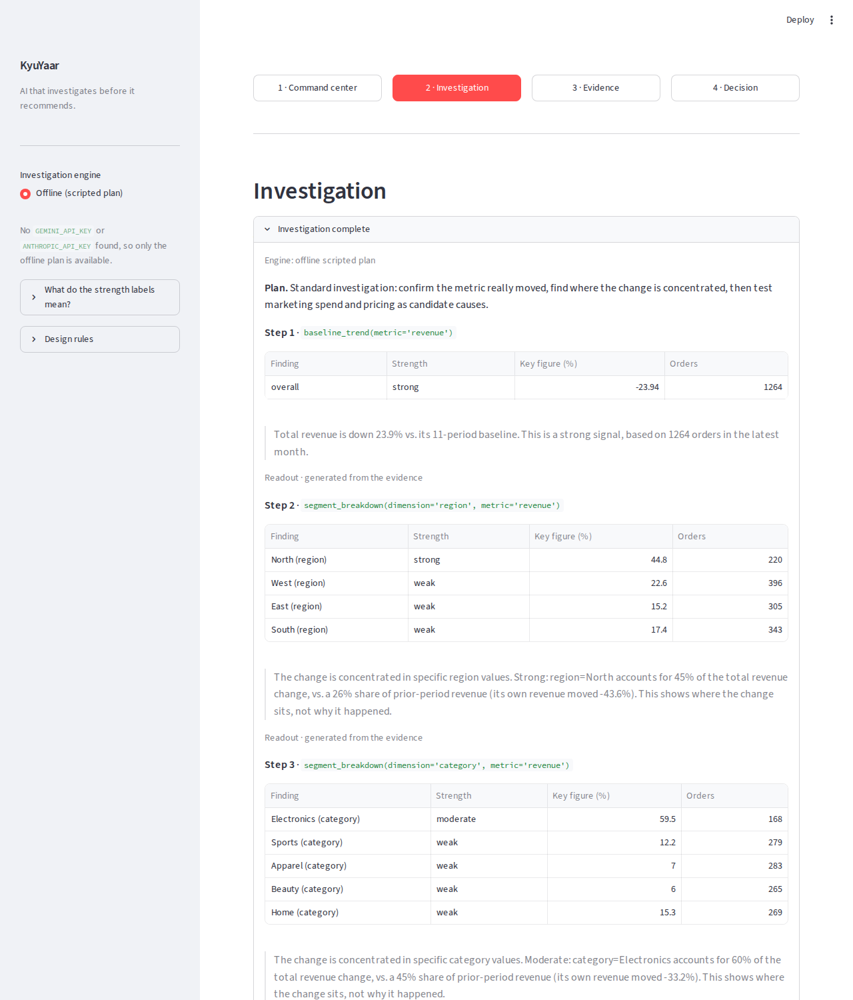
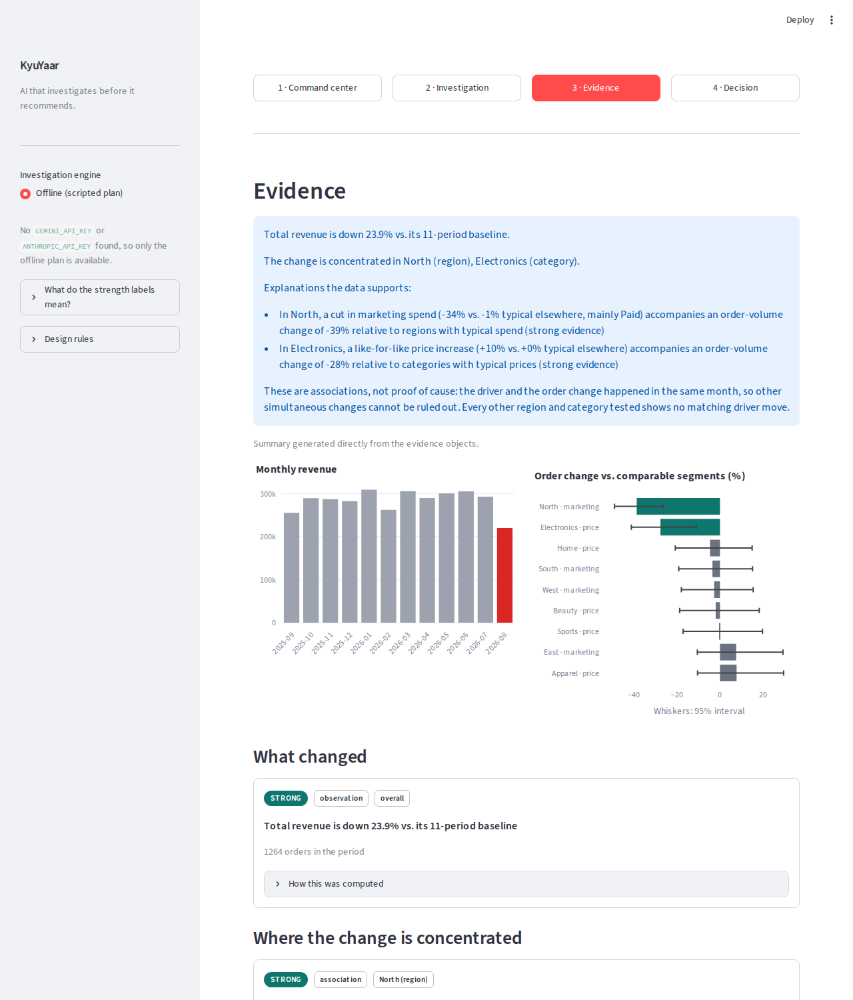
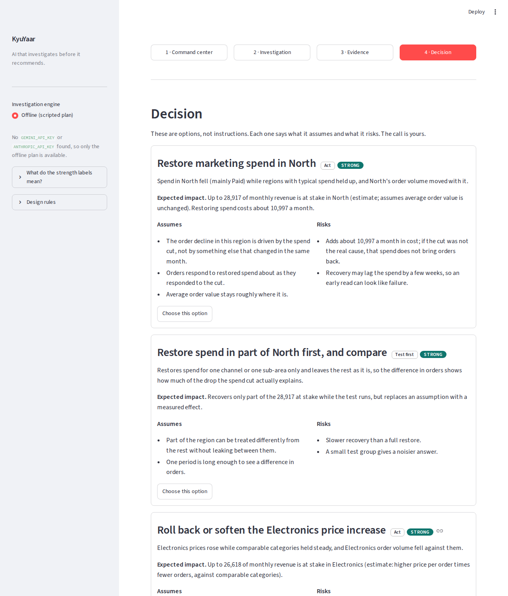
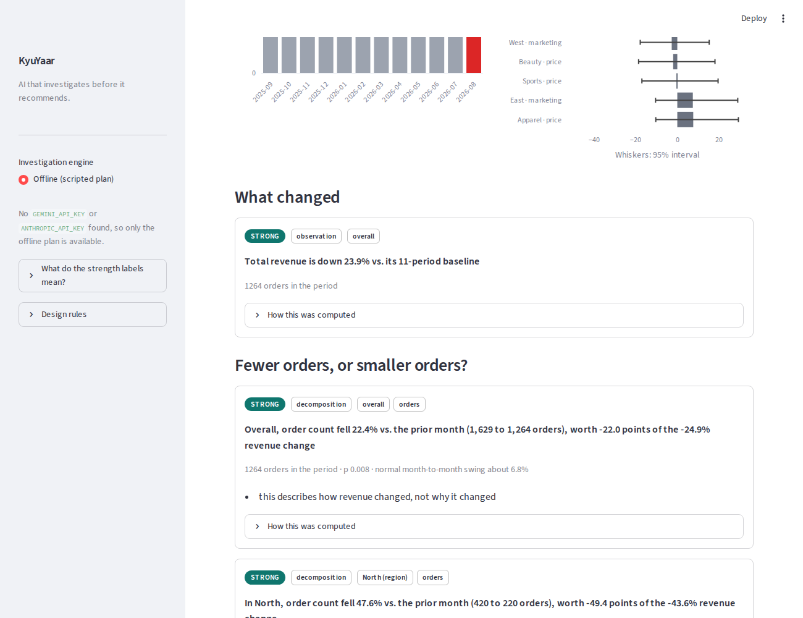

# KyuYaar
AI that investigates before it recommends.

Most dashboards can tell a business owner what changed — revenue dropped, orders fell, a channel underperformed. Almost none can tell them why and the tools that try (a generic "AI business assistant" bolted onto a chatbot) tend to generate a confident-sounding explanation with no real evidence behind it.

KyuYaar is very humble and built for small businesses, student ventures and small organizations that have operational data but no dedicated analyst. Given a question like "revenue dropped last month — why and what should I do?", it runs a real investigation: it checks the trend, breaks it down by customer segment and product, tests it against marketing spend and builds an evidence chain — each hypothesis tagged with how strong the supporting evidence actually is. Where the data doesn't clearly support a conclusion, it says so rather than guessing.

The core design principle: the LLM reasons and orchestrates the investigation; it never does the math. Every number shown to the user comes from a deterministic Python/DuckDB calculation that can be traced back to a specific query in this repo — the model's job is to plan the investigation, interpret results, and communicate uncertainty honestly, not to produce statistics from a prompt.

KyuYaar doesn't autonomously decide anything. It surfaces evidence-backed options, each with its assumptions and risks stated plainly and leaves the actual call to the person who has to live with the outcome.

## The four screens

| Command center | Investigation |
|---|---|
|  |  |

| Evidence | Decision |
|---|---|
|  |  |

## Status

| Layer | What it adds | State |
|---|---|---|
| 1 | Synthetic dataset with a known root cause, `baseline_trend()`, `segment_breakdown()` | done |
| 2 | Cause-testing tools, LLM orchestrator, decision options, Streamlit UI | done, submittable end to end |
| 3 | `aov_volume_decomposition()`: fewer orders vs. smaller orders, and a check of each supported cause against the order pattern it predicts | done |

## Run it

```bash
pip install -r requirements.txt
streamlit run app.py
```

The investigation can be driven by a live model or run offline:

| Setup | Provider |
|---|---|
| `GEMINI_API_KEY` set (free tier from Google AI Studio works) | Gemini, default model `gemini-flash-latest` |
| `ANTHROPIC_API_KEY` set | Claude, default model `claude-sonnet-5` |
| neither | offline: the same tools on a fixed plan, narrated by deterministic templates |

`KYUYAAR_PROVIDER` (`gemini` or `anthropic`) forces the choice when both keys are present, and `KYUYAAR_MODEL` overrides the default model. If a live call fails midway (quota, network), the investigation finishes in offline mode and says so. The tools, evidence, guardrail and decision options are identical across providers; only the model behind the plan and readouts changes.

```bash
python scripts/check_live.py      # one real investigation; reports whether the model drove it
```

Free tiers limit requests per minute and per day. The Gemini adapter spaces calls (`KYUYAAR_MIN_INTERVAL`, default 4 seconds), waits as long as the provider asks when it is rate limited, and treats a per-day quota as final. The model is also asked to batch independent tools into one turn, which keeps a full investigation to a handful of calls. If a live call still fails, the investigation finishes offline and says why.

```bash
python scripts/verify_layer1.py   # Layer 1 output on the dataset
python scripts/verify_layer2.py   # checks the investigation against the injected root cause
python scripts/verify_layer3.py   # orders vs. order value, ground-truth check and false-alarm count
python -m pytest                  # full test suite
```

## How an investigation works

```
question -> orchestrator -> tools -> Evidence objects -> guardrail -> UI -> decision options -> your choice
              (LLM)        (pandas)   (strength, caveats)  (number check)     (templates)
```

1. **`baseline_trend`** confirms the metric actually moved.
2. **`aov_volume_decomposition`** splits the revenue change into fewer/more orders and smaller/larger orders (details below), overall and for each region and category.
3. **`segment_breakdown`** (region, category) shows where the change is concentrated.
4. **`marketing_effect`** and **`price_effect`** test each candidate cause, region by region and category by category. A segment is only a candidate if its driver (spend, price) moved away from the typical change, and its orders are compared with segments whose driver did not move, within strata of the other dimension so a category-wide effect is not mistaken for a regional one. Effects are pooled log rate ratios with a z-test.
5. The **orchestrator** lets the model choose which tool to call next and write short readouts. Every figure in that prose is checked against the evidence (`src/guardrail.py`); prose with an unsupported figure is discarded and replaced with text generated from the Evidence object.
6. **`decisions.py`** maps supported (strong or moderate) causes to option templates, each with assumptions, risks and an impact estimate computed from the evidence. Nothing is ranked or chosen for you.

### Fewer orders, or smaller orders?

Revenue is orders x average order value (AOV), so a drop is fewer orders, smaller orders, or both, and the fix differs. `aov_volume_decomposition` compares the latest month with the one before it and returns two separately graded hypotheses per group, *order count changed* and *average order value changed*.

- **The split.** Volume effect = (N1 - N0) x (A0 + A1) / 2 and AOV effect = (A1 - A0) x (N0 + N1) / 2. Each factor's change is priced at the average of the two months' value of the other, so the two effects sum to the revenue change exactly, with no leftover interaction term. They are reported in points of prior-month revenue. When the factors offset each other one effect can be larger than the total (North: orders -49.4 points, AOV +5.8, revenue -43.6%).
- **Is the move real?** Order counts and AOV wander from month to month, and a raw two-month split has no control group to cancel that. Each factor's latest month-on-month change is compared with all earlier month-on-month changes (prediction-interval t statistic). A move that is ordinary for this business grades weak however large it looks, and fewer than six earlier changes gives weak with a caveat.
- **Strength.** The same size and p-value bars as the Layer 2 cause tests (15% with p < 0.01 strong, 8% with p < 0.05 moderate). It rates how clearly the figure moved, not why and not how much it matters to the total.
- **Checking causes against their pattern.** A marketing change should move order count and leave order size alone; a price change should move order count and order value in opposite directions. `signature_check()` compares each supported cause with the decomposition. The result shows on the evidence screen, in the summary, and in the decision options: the "average order value stays roughly where it is" assumption on a marketing option is now checked against the data instead of only stated.



Every Evidence object records the tool and arguments that produced it, and the UI shows this under "How this was computed".

## What was verified

On the synthetic dataset (a 45% cut to paid marketing in North and a 10% price rise on Electronics, both in the final month):

- North (marketing) and Electronics (price) come out strong; the other three regions and four categories come out weak.
- Across 81 hypotheses tested in earlier months with no injected cause, none was flagged.
- Layer 1 `segment_breakdown` previously ranked segments as strong even when total revenue barely moved. It now marks shares as unstable below a 10% total change.
- The orchestrator loop, guardrail and fallbacks are covered by tests using a scripted fake client.

Layer 3 on the same dataset:

- Overall, order count fell 22.4% (strong) while AOV fell 3.2% (weak): revenue fell because of fewer orders, not smaller ones.
- North is a pure order-count loss (AOV change not distinguishable from ordinary variation), the pattern a marketing cut predicts. Electronics shows fewer orders and a higher AOV (moderate), the pattern a price rise predicts. All other regions and categories stay weak.
- Run over the four earlier months that have enough history, 3 of 80 hypotheses were flagged, all moderate and none strong. That is roughly what a 5% bar produces across 20 tests a month; unlike the Layer 2 tests it is not zero, because a raw split has no control group.

## Known limits

- Both live provider paths (Gemini over REST, Claude via the SDK) are tested against scripted fake transports, not the real APIs, during development. Run `scripts/check_live.py` once with a key before relying on them.
- Evidence is association, not proof of cause. A driver and an order change in the same month cannot rule out another simultaneous change; every supported finding says so.
- The two effects overlap in North x Electronics and the data cannot separate their interaction. Options say so, and impact estimates for the two are not additive.
- One dataset, one investigation type (why did revenue change). Customer segment and channel are not exposed to the orchestrator: small segments need a significance test on the association itself before they can be ranked reliably.
- The orders-vs-order-value comparison uses the prior month, while `baseline_trend` uses the average of all earlier months, so the two headline percentages differ (revenue -24.9% vs. prior month, -23.9% vs. baseline). The summary labels which basis each figure uses.
- Order count and AOV are graded against only about ten earlier month-on-month changes, so the noise estimate is itself rough. Some findings sit close to a bar (Electronics AOV p = 0.049; South and Beauty order count p = 0.061 and 0.053, both graded weak). A month-length caveat appears when the two months differ in days.
- AOV blends products, so a fall can mean a shift in what is bought rather than smaller baskets. The tool does not separate mix from price-per-item; that would be a further split.
- `baseline_trend` compares calendar-month totals, so a short month (February) can read as a drop. Per-day normalisation is not implemented.
- The dataset is synthetic. Effect sizes here are much cleaner than real data would be.
